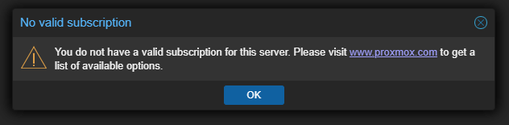

# Rid the Non Valid License prompt

---
# Option 1 - Modify `proxmoxlib.js` (needs to be modified after each system update)


Connect to your PVE
```bash
ssh root@your-proxmox-ip
nano /usr/share/javascript/proxmox-widget-toolkit/proxmoxlib.js
```
Delete or comment out this block of code (wrap in /* */ to comment the block)
```bash
Ext.Msg.show({
    title: gettext('No valid subscription'),
    ...
});
```
Or comment out
```bash
/*
Ext.Msg.show({
    title: gettext('No valid subscription'),
    ...
});
*/
```
Clear browser cache or restart Proxmox web service
```bash
systemctl restart pveproxy
```

---
# Option 2 - Use Community repository
Edit `pve-enterorise.list`
```bash
nano /etc/apt/sources.list.d/pve-enterprise.list
```
Comment out this line
```bash
# deb https://enterprise.proxmox.com/debian/pve bookworm pve-enterprise
```
Add a main source
```bash
echo "deb http://download.proxmox.com/debian/pve bookworm pve-no-subscription" >> /etc/apt/sources.list
```
Update
```bash
apt update
```

---
# Option 3 - Bash script
```bash
#!/bin/bash

# Script to remove the Proxmox "No valid subscription" popup
# Tested on Proxmox VE 7/8

PROXMOX_JS="/usr/share/javascript/proxmox-widget-toolkit/proxmoxlib.js"
BACKUP_JS="${PROXMOX_JS}.bak.$(date +%F_%T)"

# Color output
green() { echo -e "\e[32m$1\e[0m"; }
red() { echo -e "\e[31m$1\e[0m"; }

# Check if file exists
if [[ ! -f "$PROXMOX_JS" ]]; then
    red "ERROR: JavaScript file not found: $PROXMOX_JS"
    exit 1
fi

# Backup original file
cp "$PROXMOX_JS" "$BACKUP_JS"
green "Backup created at $BACKUP_JS"

# Patch file to disable the subscription popup
sed -i '/Ext.Msg.show({/,/});/s/^/\/\//' "$PROXMOX_JS"

# Restart Proxmox web service
systemctl restart pveproxy && green "pveproxy restarted."

green "✔ 'No valid subscription' popup disabled."

# OPTIONAL: Switch to no-subscription repository
read -p "Do you want to switch to the no-subscription repo? (y/n): " confirm
if [[ "$confirm" =~ ^[Yy]$ ]]; then
    echo "Disabling enterprise repo..."
    sed -i 's|^deb https://enterprise.proxmox.com|# deb https://enterprise.proxmox.com|' /etc/apt/sources.list.d/pve-enterprise.list 2>/dev/null

    echo "Adding no-subscription repo..."
    echo "deb http://download.proxmox.com/debian/pve bookworm pve-no-subscription" > /etc/apt/sources.list.d/pve-no-subscription.list

    apt update && green "✔ Switched to no-subscription repository."
else
    green "Skipped repository change."
fi

echo
green "Done. You may need to clear your browser cache to reflect the changes."
```
Make it executable
```bash
chmod +x remove_proxmox_subscription_notice.sh
```
Run it
```bash
./remove_proxmox_subscription_notice.sh
```
